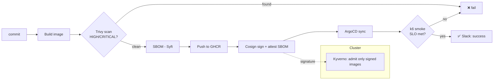

# Secure GitOps Pipeline

> A supply-chain-secure delivery pipeline for regulated environments: every commit is **scanned
> (Trivy)**, gets an **SBOM (Syft)**, is **cryptographically signed (Cosign, keyless)**, deployed via
> **GitOps (ArgoCD)**, **load-tested (k6)**, and reported to **Slack** — and the cluster **admits only
> signed images (Kyverno)**. Security is a set of automated gates, not a manual checklist.

<p align="center">
  
  
  
  
  
  
  <a href="https://github.com/JobsDart/secure-gitops-pipeline/actions"></a>
</p>

---

## Why this matters

In regulated industries (banking, insurance, healthcare — BaFin/BAIT, MiFID II) you must *prove* what
ran in production and that it was unaltered. This pipeline turns those obligations into enforced,
auditable automation: a developer **cannot** ship a vulnerable or unsigned image even if they try.

## The gates



| Gate | Tool | Fails the build when… |
|------|------|------------------------|
| 1 · Vulnerability scan | **Trivy** | a HIGH/CRITICAL, fixable CVE is found |
| 2 · Provenance | **Syft + Cosign** | (produces SBOM + keyless signature + attestation) |
| 3 · Runtime health | **k6** | error rate ≥ 1% or p95 latency ≥ 500ms |
| Admission | **Kyverno** | an image isn't signed by *this* pipeline's identity |

---

## Repository layout

```
secure-gitops-pipeline/
├── app/                              # Tiny scannable image (nginx static site)
├── .github/workflows/
│   └── secure-pipeline.yaml          # build → scan → SBOM → sign → deploy → k6 → Slack
├── policy/kyverno-verify-images.yaml # cluster admits only Cosign-signed images
├── load/smoke.js                     # k6 smoke/load test with SLO thresholds
├── gitops/
│   ├── argocd-application.yaml        # ArgoCD app (auto-sync, self-heal)
│   └── manifests/                     # the deployed Deployment + Service
└── docs/                             # architecture, the failing-gate walkthrough, ADRs
```

---

## See a gate fail (the important demo)

Security gates only matter if you can show them blocking a bad change. See
[docs/DEPLOYMENT.md](docs/DEPLOYMENT.md#demonstrating-a-failing-gate) for two reproducible failures:
1. **Vulnerable base image** → Trivy fails the build (with the SARIF shown in GitHub code scanning).
2. **Unsigned image** → Kyverno rejects the Pod at admission.

## Required secrets / setup
`SLACK_WEBHOOK`, optional `ARGOCD_SERVER` / `ARGOCD_AUTH_TOKEN`, `TARGET_URL`. Keyless Cosign signing
needs no key — it uses the workflow's GitHub OIDC identity (`id-token: write`).

---

## Documentation
- [Architecture](docs/ARCHITECTURE.md) · [Deployment & failing-gate demo](docs/DEPLOYMENT.md) · [Debugging](docs/DEBUGGING.md) · [ADRs](docs/adr/)

## License
[MIT](LICENSE) © JobsDart. Uses open-source Trivy, Syft, Cosign, ArgoCD, Kyverno and k6 (each under its own license).
